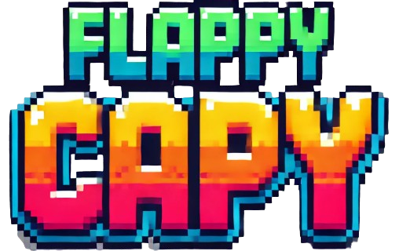

#### Table of contents
1. [Giới thiệu](#introduction)
2. [Tính năng](#features)
3. [Hướng dẫn](#play)
4. [Các nguồn tham khảo](#installation)

# Giới thiệu 

* Flappy Capy được lấy cảm hứng từ [Flappy Bird](https://wikipedia.org/wiki/Flappy_Bird) - trò chơi nổi tiếng do Nguyễn Hà Đông phát triển vào năm 2013.
* Trò chơi được tạo bằng [SDL2](https://www.libsdl.org/download-2.0.php) và C++/C.
* Ý tưởng lấy từ chú Capybara nổi từ năm 2024 pha với một chút UIA Cat meme và được điều chỉnh phù hợp với game.
* Đây là dự án nhỏ cho học phần môn Lập trình nâng cao (2425II_INT2215_4) tại Trường Đại học Công nghệ - Đại học Quốc gia Hà Nội ([UET-VNU](https://vi.wikipedia.org/wiki/Tr%C6%B0%E1%BB%9Dng_%C4%90%E1%BA%A1i_h%E1%BB%8Dc_C%C3%B4ng_ngh%E1%BB%87,_%C4%90%E1%BA%A1i_h%E1%BB%8Dc_Qu%E1%BB%91c_gia_H%C3%A0_N%E1%BB%99i))

# Tính năng 

**1. Game Window**
* Xử lý va chạm giữa nhân vật với ống nước, mặt đất và biên của màn hình.
* Xử lý các thao tác phím từ người chơi.
* Hiển thị điểm số và trạng thái trò chơi.
* Chuyển động của nhân vật và nền giúp trò chơi chân thực hơn.
* Giới hạn FPS để đảm bảo trò chơi chạy mượt trên thiết bị.

**2. Intro Game**
* Giới thiệu tên game.
* Giới thiệu cách chơi.

**2. Game Over Screen**
* Hiển thị điểm số hiện tại và điểm cao nhất.
* Cho phép chơi lại nhanh bằng cách nhấn SPACE.

# Hướng dẫn 
* Nhấn SPACE để điều khiển capybara bay lên.
* Tránh va chạm với ống nước để đạt điểm cao nhất.
* Khi thua, nhấn SPACE để chơi lại.
* Video hướng dẫn [Google Drive](https://drive.google.com/file/d/1TelfcBAVWYSXlHDnZoncXZ5YW6qz5tZL/view?usp=sharing)

# Các nguồn tham khảo 

* Ảnh Capy vẽ bằng [8bit Painter](https://play.google.com/store/apps/details?id=com.onetap.bit8painter)
* Nền và ống tạo bởi [Meta AI](https://ai.meta.com/meta-ai/)
* Nhạc nền lấy từ [Parabay](https://pixabay.com/vi/music/search/lofi/?fbclid=IwZXh0bgNhZW0CMTEAAR2Pe8Uet4KfY68IOV_Lq-MMuII_w0j7xA0B2rPKOE1adSPbrM7odikEtMQ_aem_9JHalpCkn9oYqYGJ7baMpQ)
* Âm thanh nhảy lấy từ [Mixkit](https://mixkit.co/free-sound-effects/game/?fbclid=IwZXh0bgNhZW0CMTEAAR0aQLZUE-p4b-ymNBjwf6IKReo3uqoY0IRzsPzn6BMmfPRwEAIAGgtnhDw_aem_9HE2dA-44lYN7hWKrczbRQ)

